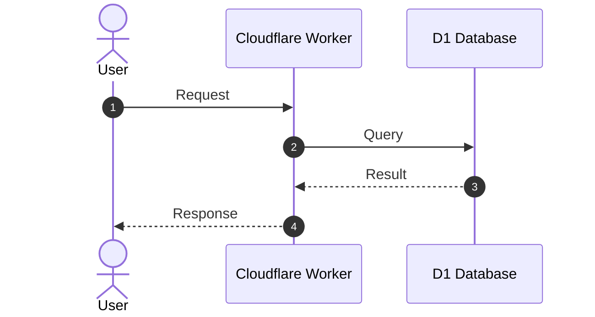

# Document Title

> **Executive Summary**: High-level context explaining the problem solved, architectural choices made, and operational impacts.

---

## 1. Overview & Business Objectives

- **Problem Statement**: What problem or risk does this feature address?
- **Goals**: Key objectives and measurable outcomes.
- **Non-Goals**: Explicit out-of-scope items.

---

## 2. Architecture & Design Decisions

### Key Architectural Choices

| Decision | Rationale | Alternatives Considered | Trade-offs |
| :--- | :--- | :--- | :--- |
| **Choice A** | Why this option was chosen | Other rejected options | Benefits vs costs |

---

## 3. System Architecture & Flow



---

## 4. Implementation Details

### File & Component Breakdown

- `path/to/file1.ts`: Primary responsibility and key exported functions.
- `path/to/file2.sql`: Schema definitions and constraints.

---

## 5. Configuration & API Reference

### Configuration Specification

```jsonc
// Key configuration settings with explanatory comments
```

### Endpoints / Interfaces

`POST /example/route`
- **Headers**: `Cookie`, `cf-connecting-ip`
- **Response**: `200 OK` or `429 Too Many Requests`

---

## 6. Verification & Operational Testing

- **Local Verification Commands**: Step-by-step commands (`curl`, `bun run ...`) to test functionality.
- **Expected Results**: Sample output signatures for success and failure cases.

---

## 7. Maintenance & Troubleshooting

- **Common Issues**: Known edge cases and failure modes.
- **Monitoring & Observability**: Logs, metrics, and debugging steps.
