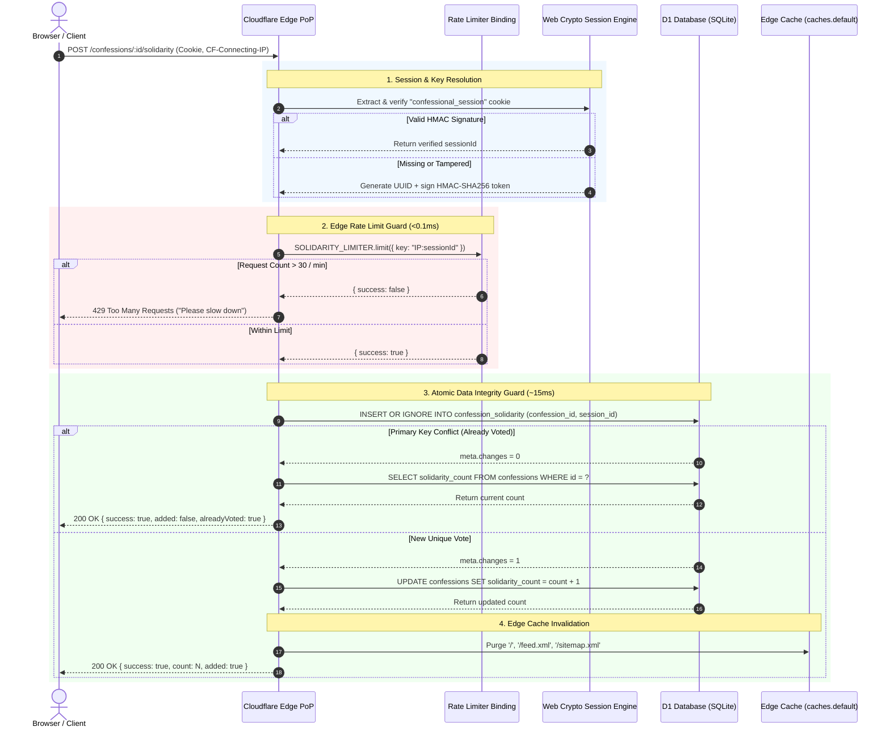

# Edge Rate Limiting & Data Integrity Architecture

> **Executive Summary**: Prompt Confessional uses a multi-tier security and data integrity model. Traffic flood protection is enforced at the Cloudflare Edge Point-of-Presence (PoP) in `<0.1ms` using native Workers Rate Limiter bindings (`CONFESSION_LIMITER`, `SOLIDARITY_LIMITER`). Global data integrity and single-vote enforcement are guaranteed at the database layer using D1 SQLite composite primary keys (`confession_id`, `session_id`) combined with Web Crypto HMAC-SHA256 signed session cookies.

---

## 1. Overview & Business Objectives

### Problem Statement
As an anonymous platform, Prompt Confessional is susceptible to two main vectors of abuse:
1. **Traffic Flooding / Denial of Service**: Automated scripts or browser console loops submitting thousands of confessions or reaction clicks per minute.
2. **Reaction Fraud & Data Corruption**: A single user clicking "Show Solidarity" repeatedly to artificially inflate the count on a post.

### Objectives
- **Sub-Millisecond Guard Rails**: Reject flood traffic at the Cloudflare Edge before executing database queries or rendering JSX views.
- **100% Consistent Vote Uniqueness**: Ensure each user session can only register a single "Solidarity" vote per confession, regardless of geographical location or concurrent requests.
- **NAT-Aware Rate Limiting**: Prevent rate-limiting entire office networks or cellular gateways sharing a single IP address.

### Non-Goals
- Mandatory user registration / OAuth login (the platform remains 100% anonymous).

---

## 2. Architecture & Design Decisions

| Layer | Technology | Decision & Rationale | Trade-offs |
| :--- | :--- | :--- | :--- |
| **Edge Defense** | Cloudflare Workers Rate Limiter Binding (`env.LIMITER`) | Evaluates request counts in edge memory at `<0.1ms` latency without database or KV network calls. | PoP-local counters; sufficient for traffic defense. |
| **Rate Limit Key** | `${clientIp}:${sessionId}` | Combines `CF-Connecting-IP` with verified session UUID. Avoids locking out multiple legitimate users behind shared NAT IPs. | Requires valid session extraction on each request. |
| **Session Security** | Web Crypto HMAC-SHA256 (`crypto.subtle`) | Cryptographically signs session cookies (`confessional_session`). Prevents clients from forging random session IDs to bypass 1-vote limits. | Microsecond CPU overhead for Web Crypto signature verification. |
| **Data Integrity** | D1 Composite Primary Key `(confession_id, session_id)` | Relational SQLite table enforces strict atomic uniqueness across concurrent requests globally. | Involves a ~10-20ms SQL transaction on valid vote attempts. |

---

## 3. System Execution Flow



---

## 4. Implementation Details

### File Breakdown

1. **`wrangler.jsonc`**:
   Defines edge rate limiter namespaces:
   ```jsonc
   "ratelimits": [
     {
       "name": "CONFESSION_LIMITER",
       "namespace_id": "1001",
       "simple": { "limit": 5, "period": 60 }
     },
     {
       "name": "SOLIDARITY_LIMITER",
       "namespace_id": "1002",
       "simple": { "limit": 30, "period": 60 }
     }
   ]
   ```

2. **`migrations/0002_rate_limits_and_solidarity.sql`**:
   Relational SQLite schema for vote tracking and post reporting:
   ```sql
   CREATE TABLE IF NOT EXISTS confession_solidarity (
     confession_id TEXT NOT NULL REFERENCES confessions(id) ON DELETE CASCADE,
     session_id TEXT NOT NULL,
     created_at TEXT NOT NULL DEFAULT (datetime('now')),
     PRIMARY KEY (confession_id, session_id)
   );
   ```

3. **`src/auth/session.ts`**:
   Exports `getOrCreateSessionId(cookieHeader)` which verifies HMAC tokens and issues 1-year HttpOnly, SameSite=Lax cookies when missing or forged.

4. **`src/db/confessions.ts`**:
   Exports `incrementSolidarity(db, id, sessionId)`:
   - Performs `INSERT OR IGNORE INTO confession_solidarity ...`.
   - Checks `insertResult.meta.changes` to detect whether vote was added or skipped.

5. **`src/api/router.ts`**:
   Wires middleware, session cookie setting, rate limiters (`c.env.SOLIDARITY_LIMITER`), cache purging, and HTTP error responses.

---

## 5. Configuration & API Reference

### Rate Limits Summary

| Endpoint | Limiter | Threshold | Key Format | Failure Action |
| :--- | :--- | :--- | :--- | :--- |
| `POST /confessions` | `CONFESSION_LIMITER` | 5 / 60 seconds | `${clientIp}:${sessionId}` | `429 Rate limit exceeded` |
| `POST /confessions/:id/solidarity` | `SOLIDARITY_LIMITER` | 30 / 60 seconds | `${clientIp}:${sessionId}` | `429 Rate limit exceeded` |

### API Response Format

#### `POST /confessions/:id/solidarity`
- **Request Headers**: `Accept: application/json`, `Cookie: confessional_session=...`
- **Success (New Vote)**:
  ```json
  { "success": true, "count": 45, "added": true, "alreadyVoted": false }
  ```
- **Success (Duplicate Skipped)**:
  ```json
  { "success": true, "count": 45, "added": false, "alreadyVoted": true }
  ```
- **Rate Limit Exceeded**:
  - Status: `429 Too Many Requests`
  - Body: `Rate limit exceeded. Please slow down.`

---

## 6. Verification & Operational Testing

### Local Test Commands

1. **Test Initial Solidarity Vote**:
   ```bash
   curl -i -X POST http://localhost:8787/confessions/test-uuid-1/solidarity \
     -H "Accept: application/json"
   ```
   *Expected Output*: `HTTP/1.1 200 OK`, `Set-Cookie: confessional_session=...`, `{"success":true,"count":45,"added":true,"alreadyVoted":false}`.

2. **Test Duplicate Vote Prevention**:
   ```bash
   curl -i -X POST http://localhost:8787/confessions/test-uuid-1/solidarity \
     -H "Accept: application/json" \
     -H "Cookie: confessional_session=<SESSION_COOKIE_VALUE>"
   ```
   *Expected Output*: `HTTP/1.1 200 OK`, `{"success":true,"count":45,"added":false,"alreadyVoted":true}`.

3. **Test Post Reporting**:
   ```bash
   curl -i -X POST http://localhost:8787/confessions/test-uuid-1/report \
     -H "Accept: application/json" \
     -d "reason=Spam+or+harassment"
   ```
   *Expected Output*: `HTTP/1.1 200 OK`, `{"success":true,"message":"Report submitted successfully"}`.

---

## 7. Maintenance & Troubleshooting

- **Updating Rate Limits**: Modify `simple.limit` or `simple.period` in `wrangler.jsonc` and run `bun run deploy`.
- **Applying Remote Database Migrations**: Run `bun run db:migrate:remote` (`bunx wrangler d1 migrations apply DB --remote`).
- **Investigating Rate Limits**: Check Cloudflare Worker analytics dashboard under **Workers & Pages > ugh-llms > Metrics > Rate Limiting**.
