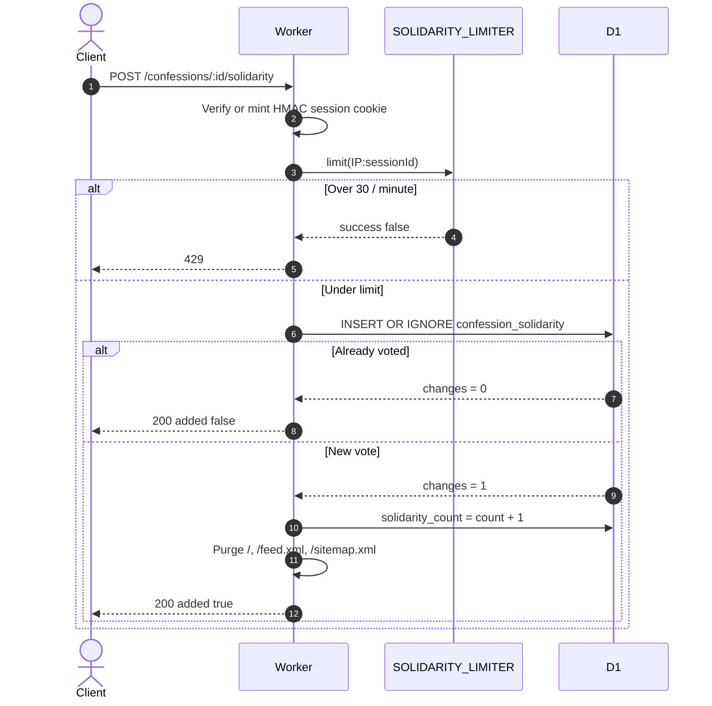

# Rate limiting and vote integrity

Prompt Confessional is anonymous, so abuse control cannot depend on logins. Flooding is stopped at the Cloudflare edge. Duplicate solidarity votes are stopped in D1.

## Layers

| Layer | Mechanism | Trade-off |
| --- | --- | --- |
| Edge | Workers rate limiter bindings | Counts are per PoP, not global. Fast enough for flood defense. |
| Rate-limit key | `${clientIp}:${sessionId}` | Shared office/cellular IPs are not blanket-locked. Needs a valid session cookie. |
| Session | HMAC-SHA256 cookie `confessional_session` | Stops clients minting random session ids to vote twice. Secret is currently a hardcoded default. |
| Votes | D1 composite PK `(confession_id, session_id)` + `INSERT OR IGNORE` | One extra write on a real vote. Globally unique. |

## Solidarity request path



## Limits

| Endpoint | Binding | Threshold | On exceed |
| --- | --- | --- | --- |
| `POST /confessions` | `CONFESSION_LIMITER` | 5 / 60s | 429 |
| `POST /confessions/:id/solidarity` | `SOLIDARITY_LIMITER` | 30 / 60s | 429 |

Configured in `wrangler.jsonc`. Schema for votes and reports is `migrations/0002_rate_limits_and_solidarity.sql`.

## Content filters

Every confession, suggestion, and author name is run through:

1. `redactSecrets` in `src/utils/gitleaks.ts` — API keys, JWTs, private keys, emails become `[REDACTED_*]`
2. `sanitizeContent` in `src/utils/moderation.ts` — racial slurs / hate speech become `[censored]`; frustration swearing is kept

Reports are stored in `confession_reports`. Hiding a post is a CLI action (`bun run moderate hide <id>`), which sets `is_hidden = 1`. Public queries always filter that column.

## Local checks

```bash
curl -i -X POST http://localhost:8787/confessions/<id>/solidarity \
  -H "Accept: application/json"
```

First call should set `confessional_session` and return `added: true`. Repeat with that cookie and you should get `alreadyVoted: true`.
